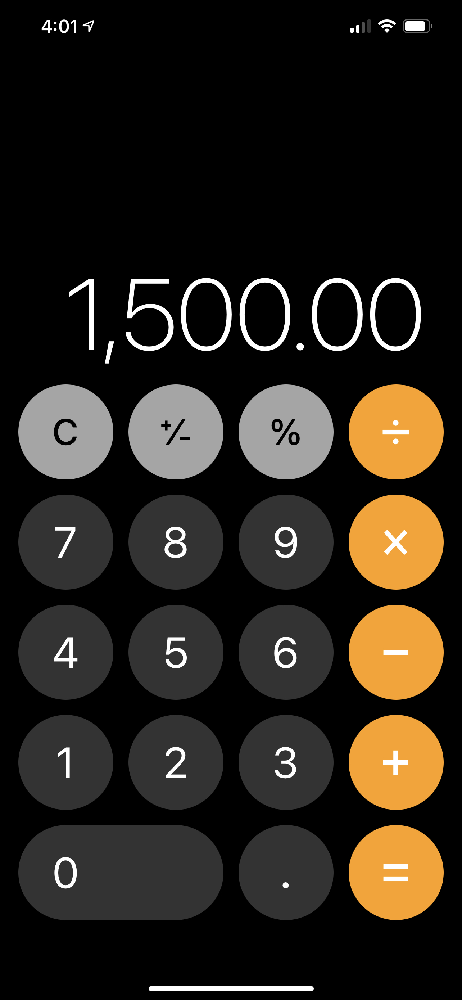

# Calculadora con React Native y TypeScript



## Instalar App pasos:

> Clonar repositorio

```
git clone https://github.com/JeralPineda/RN-Calculator.git
```

> Ejecutar en la terminal

```
npm install
```

o también

```
yarn install
```

> Correr la app en android

```
npx react-native run-android
```
